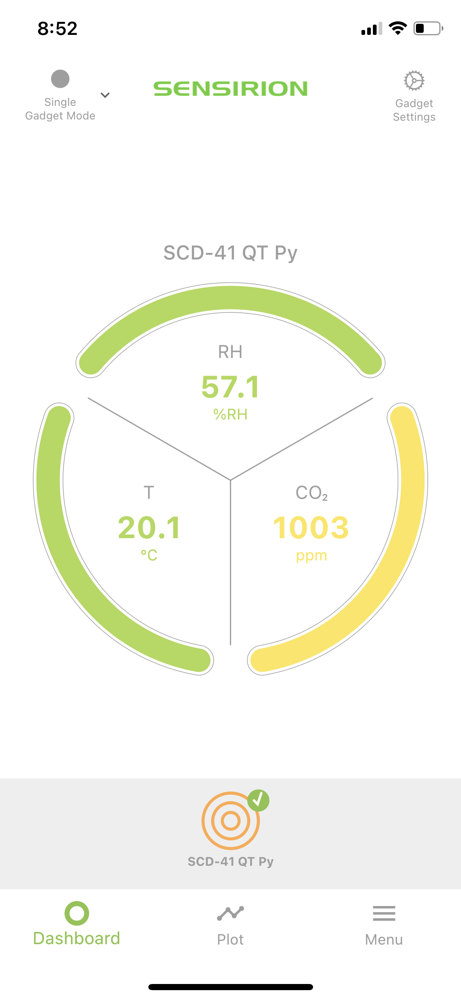
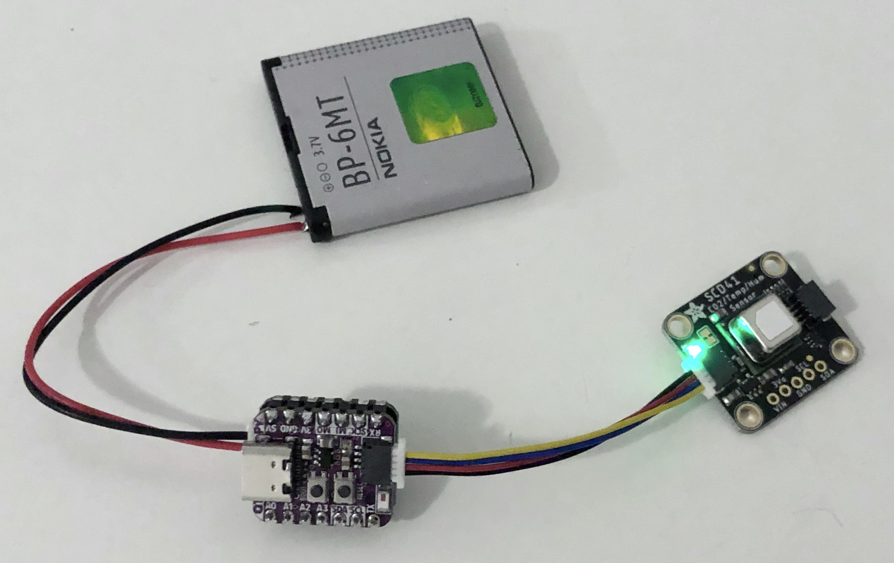

# Adafruit SCD4X/SCD30 CO2 sensor for ESP32

An Arduino sketch for the [Adafruit SCD4X CO2 sensor](https://github.com/adafruit/Adafruit_CircuitPython_SCD4X) and [Adafruit SCD-30 CO2 sensor](https://github.com/adafruit/Adafruit_SCD30) running on an ESP32 with an http server returning [Prometheus](https://prometheus.io) compatible responses, and sensor readings sent via Bluetooth BLE.


Related software:

* [Prometheus/Grafana Docker containers for Raspberry Pi](https://github.com/sighmon/prometheus-grafana-raspberry-pi)
* [Apple HomeKit accessory for the SCD4x/SCD-30 CO2 sensor](https://github.com/sighmon/homekit-scd4x)
* [Sensirion iOS app](https://apps.apple.com/ch/app/sensirion-myambience-co2/id1529131572)

## Hardware

* [Adafruit SCD-41 CO2 sensor](https://www.adafruit.com/product/5190)
* [Adafruit ESP32-C3 QT Py dev board](https://www.adafruit.com/product/5405)
* [Adafruit battery charger for QT Py](https://www.adafruit.com/product/5397)
* [Adafruit Qwiic cable](https://www.adafruit.com/product/4399)
* Nokia BP-6MT 3.7V battery (any 3.7 - 4.2V battery will work)

## Setup

**WiFi**:

* Copy the secrets file: `cp secrets.tmpl.h secrets.h`
* Fill in your SSID and password in `secrets.h`
* **Note**: the ESP32-C3 only connects to a 2.4 GHz network

**Arduino**:

* Download the latest version of Arduino from https://www.arduino.cc
* From `Tools > Manage Libraries...` add the library: `Sensirion I2C SCD4x`
* If you have an `SCD-30` CO2 sensor, add the library: `Adafruit SCD30`
* Uncomment either `#define USESCD30` or `#define USESCD4X`
* Install the Sensirion BLE library: `cd ~/Documents/Arduino/library` and then `git clone https://github.com/Sensirion/arduino-ble-gadget.git`
* Install the NimBLE library: `cd ~/Documents/Arduino/library` and then `git clone https://github.com/h2zero/NimBLE-Arduino.git`
* Install the Adafruit boards [following their instructions](https://learn.adafruit.com/adafruit-qt-py-esp32-c3-wifi-dev-board/arduino-ide-setup)
* Connect your ESP32 via USB
* Now try `Upload` to send the code to your ESP32

**Note**: As of 9th April 2024 this was the dependency versions that compiled on a Sparkfun ESP32 Thing:

* `git clone git@github.com:Sensirion/arduino-ble-gadget.git` into `~/Arduino/libraries` and then `git checkout tags/1.2.0` and add `#include <string>` to `ByteArray.h`
* `git clone git@github.com:Sensirion/arduino-upt-core.git Sensirion_UPT_Core` into `~/Arduino/libraries` and then `git checkout 919ef8b`
* `git clone git@github.com:h2zero/NimBLE-Arduino.git` into `~/Arduino/libraries` and then `git checkout release/1.4`
* Install the `ESP32` boards library at `v2.0.11`

**iOS app**:

I built an iOS/macOS app so location data can be saved with CO2 reading data.

Project code: [ios-ble-co2-sensor](https://github.com/sighmon/ios-ble-co2-sensor)


This code also works with the standard Sensirion MyAmbience app:

* Install the Sensirion MyAmbience app: [iOS](https://apps.apple.com/ch/app/sensirion-myambience-co2/id1529131572)/[Android](https://play.google.com/store/apps/details?id=com.sensirion.myam)
* Turn on Bluetooth on your device
* The readings should update every 5 seconds



## Serial monitor

If you open the Arduino serial monitor you'll see:

* The WiFi output as it attempts to connect to your WiFi network
* The SCD4X/SCD-30 CO2 readings

## LEDs

While starting up the LED will light up in this sequence

* Red blink - setup is starting
* Blue slow blink - trying to connect to WiFi
* Green blink - connected

While running:

* Green pulse for an http request
* Blue pulse for a BLE reading sent

## http response

Once your ESP32 has connected to your SSID, it will respond over port 80 with a [Prometheus](https://prometheus.io) response. e.g. `curl 192.168.1.100:80/metrics`

```bash
# HELP ambient_temperature Ambient temperature
# TYPE ambient_temperature gauge
ambient_temperature 19.95
# HELP ambient_humidity Ambient humidity
# TYPE ambient_humidity gauge
ambient_humidity 59.20
# HELP co2 CO2
# TYPE co2 gauge
co2 1333
# HELP battery_voltage Battery voltage
# TYPE battery_voltage gauge
battery_voltage 3.15
```

My ESP32-C3 with the SCD-41 CO2 sensor running off of an old Nokia BP-6MT battery.



## Thanks

Shoutout to [Core Electronics](https://core-electronics.com.au) for being so fast with their delivery of the [Adafruit SCD-41](https://core-electronics.com.au/adafruit-scd-41-ndir-co2-temperature-and-humidity-sensor-stemma-qt-qwiic.html).

## Licenses

* My code: MIT License
* ESP32 example code `SimpleWiFiServer` by Jan Hendrik Berlin
* Sensirion I2C SCD4X example code `exampleUsage` license:

Copyright (c) 2021, Sensirion AG
All rights reserved.

Redistribution and use in source and binary forms, with or without
modification, are permitted provided that the following conditions are met:

* Redistributions of source code must retain the above copyright notice, this list of conditions and the following disclaimer.
* Redistributions in binary form must reproduce the above copyright notice, this list of conditions and the following disclaimer in the documentation and/or other materials provided with the distribution.
* Neither the name of Sensirion AG nor the names of its contributors may be used to endorse or promote products derived from this software without specific prior written permission.

THIS SOFTWARE IS PROVIDED BY THE COPYRIGHT HOLDERS AND CONTRIBUTORS "AS IS"
AND ANY EXPRESS OR IMPLIED WARRANTIES, INCLUDING, BUT NOT LIMITED TO, THE
IMPLIED WARRANTIES OF MERCHANTABILITY AND FITNESS FOR A PARTICULAR PURPOSE
ARE DISCLAIMED. IN NO EVENT SHALL THE COPYRIGHT HOLDER OR CONTRIBUTORS BE
LIABLE FOR ANY DIRECT, INDIRECT, INCIDENTAL, SPECIAL, EXEMPLARY, OR
CONSEQUENTIAL DAMAGES (INCLUDING, BUT NOT LIMITED TO, PROCUREMENT OF
SUBSTITUTE GOODS OR SERVICES; LOSS OF USE, DATA, OR PROFITS; OR BUSINESS
INTERRUPTION) HOWEVER CAUSED AND ON ANY THEORY OF LIABILITY, WHETHER IN
CONTRACT, STRICT LIABILITY, OR TORT (INCLUDING NEGLIGENCE OR OTHERWISE)
ARISING IN ANY WAY OUT OF THE USE OF THIS SOFTWARE, EVEN IF ADVISED OF THE
POSSIBILITY OF SUCH DAMAGE.
