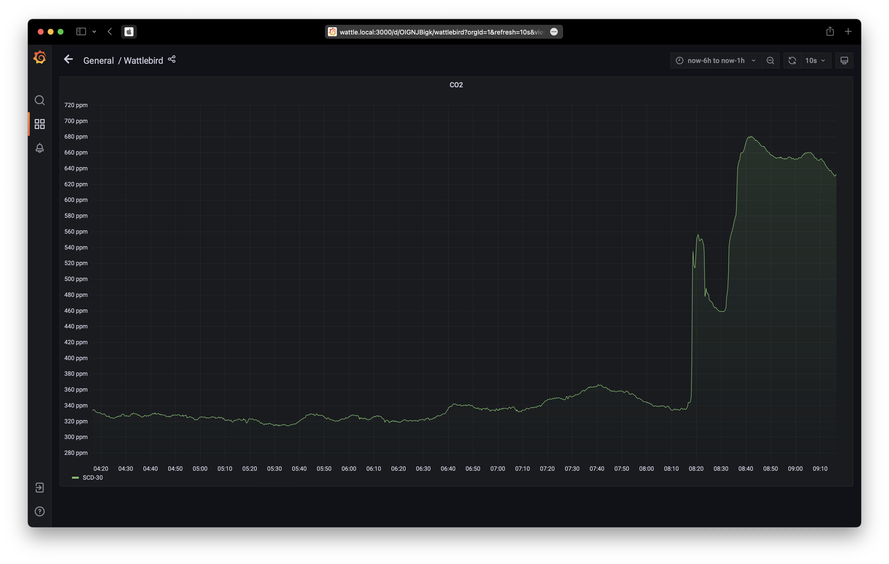
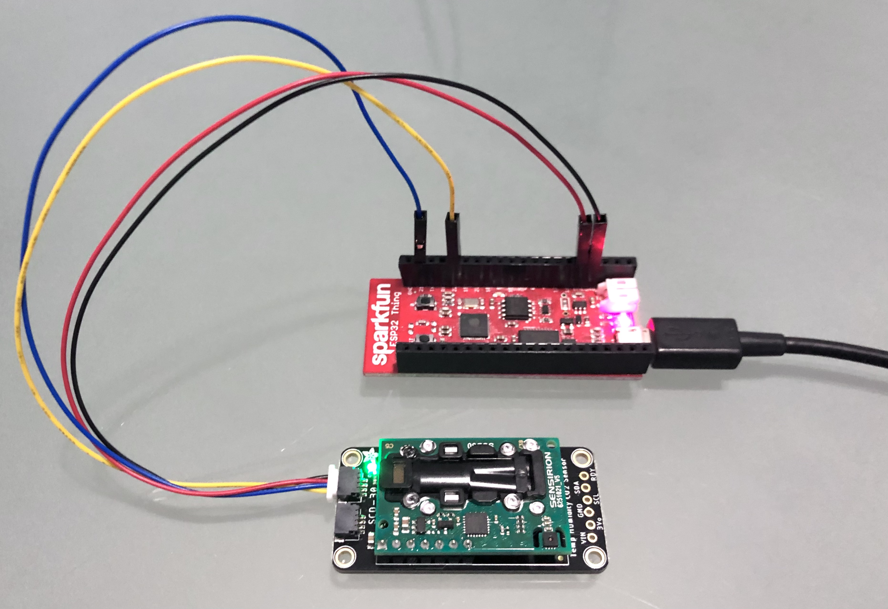

# Adafruit SCD-30 CO2 sensor for ESP32

An Arduino sketch for the [Adafruit SCD-30 CO2 sensor](https://www.adafruit.com/product/4867) running on an ESP32 with an http server returning [Prometheus](https://prometheus.io) compatible responses.



Related software:

* [Prometheus/Grafana Docker containers for Raspberry Pi](https://github.com/sighmon/prometheus-grafana-raspberry-pi)
* [Apple HomeKit accessory for the SCD4x CO2 sensor](https://github.com/sighmon/homekit-scd4x)

## Setup

**WiFi**:

* Copy the secrets file: `cp secrets.tmpl.h secrets.h`
* Fill in your SSID and password in `secrets.h`
* **Note**: my [ESP32 Thing](https://www.sparkfun.com/products/13907) would only connect to a 2.4 GHz network

**Arduino**:

* Download the latest version of Arduino from https://www.arduino.cc
* From `Tools > Manage Libraries...` add the library: `Adafruit SCD30`
* Install the Sensirion BLE library: `cd ~/Documents/Arduino/library` and then `git clone https://github.com/Sensirion/arduino-ble-gadget.git`
* Install the NimBLE library: `cd ~/Documents/Arduino/library` and then `git clone https://github.com/h2zero/NimBLE-Arduino.git`
* Connect your ESP32 via USB
* From `Tools > Board` choose your ESP32 board, port, and speed: `115200`
* Now try `Upload` to send the code to your ESP32

**iOS/macOS Bluetooth app**:

I built an iOS/macOS app so location data can be saved with CO2 reading data.

Project code: [ios-ble-co2-sensor](https://github.com/sighmon/ios-ble-co2-sensor)


This code also works with the standard Sensirion MyAmbience app:

* Install the Sensirion MyAmbience app: [iOS](https://apps.apple.com/ch/app/sensirion-myambience-co2/id1529131572)/[Android](https://play.google.com/store/apps/details?id=com.sensirion.myam)
* Turn on Bluetooth on your device
* The readings should update every 5 seconds

## Serial monitor

If you open the Arduino serial monitor you'll see:

* The WiFi output as it attempts to connect to your WiFi network
* The http response including the SCD-30 CO2 readings

## http response

Once your ESP32 has connected to your SSID, it will respond over port 80 with a [Prometheus](https://prometheus.io) response. e.g. `curl 192.168.1.100:80/metrics`

```bash
# HELP ambient_temperature Ambient temperature
# TYPE ambient_temperature gauge
ambient_temperature 29.70
# HELP ambient_humidity Ambient humidity
# TYPE ambient_humidity gauge
ambient_humidity 55.85
# HELP co2 CO2
# TYPE co2 gauge
co2 627
```

My ESP32 Thing with the SCD-30 CO2 sensor running off of two recycled 18650 laptop batteries.



## Thanks

Shoutout to [Core Electronics](https://core-electronics.com.au) for being so fast with their delivery of the [Adafruit SCD-30](https://core-electronics.com.au/adafruit-scd-30-ndir-co2-temperature-and-humidity-sensor-stemma-qt-qwiic.html).

## Licenses

* My code: MIT License
* ESP32 example code `SimpleWiFiServer` by Jan Hendrik Berlin
* Adafruit SCD30 test Copyright (c) 2020 Bryan Siepert for Adafruit Industries: BSD License
